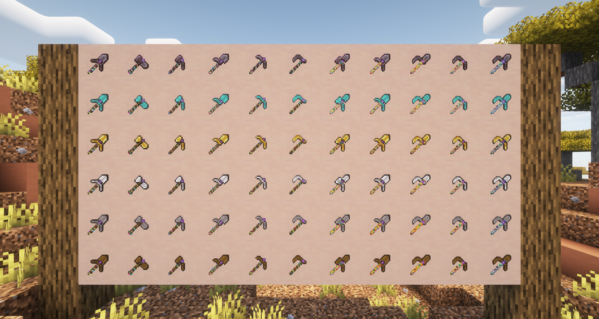

# UltimateMultiTool

The ultimate Minecraft MultiTool datapack (and resourcepack)

## Features

- Allows combining any combination of tools
- Discoverable recipes for the vanilla recipe book
- Upgrading your diamond tools via the smithing table works
- Enchantments and item renaming works. Everything with an axe can additionally receive damage enhancing enchantments
- Easy to use commands to give the items outright: `/loot give @s loot umultitool:<material>_<tool>` (example:
	`/loot give @s loot umultitool:netherite_paxeloe`)
- Only one continuously running command with a predicate in place to further reduce the impact (required for the
	netherite upgrading logic)

# Screenshots

## Useful Stuff

Some stuff that helps me create this pack.  
You might get some use out of it as well, as this contains all internal values and much more.

### Links

These links helped me create this pack

- https://gitlab.project-creative.net/BrainStone/MCPackPacker
- https://minecraft.wiki/w/Pack_format
- https://minecraft.wiki/w/Tutorials/Models#Item_predicates
- https://minecraft.wiki/w/Recipe
- https://minecraft.wiki/w/Data_component_format
- https://minecraft.wiki/w/Raw_JSON_text_format
- https://minecraft.wiki/w/Item_modifier
- https://minecraft.wiki/w/Advancement_definition
- https://minecraft.wiki/w/Predicate
- https://minecraft.wiki/w/Item_sub-predicate
- https://minecraft.wiki/w/Tag
- https://www.digminecraft.com/lists/color_list_pc.php
- Inspiration: https://modrinth.com/datapack/paxels
- https://github.com/misode/mcmeta
- https://github.com/Ersatz77/mcdata

### Custom Model Calculation

Base value: 1236864 (randomly chosen by smashing the keyboard and setting the last few bits to 0)

| Flag | Meaning          |
|------|------------------|
| 0x01 | Contains Shovel  |
| 0x02 | Contains Pickaxe |
| 0x04 | Contains Axe     |
| 0x08 | Contains Hoe     |

#### Tool Names

| Flag | Included Tools            | Tool Name           | Tier |
|------|---------------------------|---------------------|------|
| 0x00 |                           |                     |      |
| 0x01 | *Shovel*                  | *Shovel*            |      |
| 0x02 | *Pickaxe*                 | *Pickaxe*           |      |
| 0x03 | Shovel, Pickaxe           | Povel               | 1    |
| 0x04 | *Axe*                     | *Axe*               |      |
| 0x05 | Shovel, Axe               | Shaxe               | 1    |
| 0x06 | Pickaxe, Axe              | Paxe                | 1    |
| 0x07 | Shovel, Pickaxe, Axe      | Paxel (the classic) | 2    |
| 0x08 | *Hoe*                     | *Hoe*               |      |
| 0x09 | Shovel, Hoe               | Hovel               | 1    |
| 0x0A | Pickaxe, Hoe              | Poe                 | 1    |
| 0x0B | Shovel, Pickaxe, Hoe      | Poveloe             | 2    |
| 0x0C | Axe, Hoe                  | Haxe                | 1    |
| 0x0D | Shovel, Axe, Hoe          | Shaxoe              | 2    |
| 0x0E | Pickaxe, Axe, Hoe         | Paxoe               | 2    |
| 0x0F | Shovel, Pickaxe, Axe, Hoe | Paxeloe             | 3    |

### Default Tool Data

#### Material Name, Durability & Mining Speeds

| Material  | Material Name | Durability | Speed |
|-----------|---------------|------------|-------|
| Wood      | wooden        | 59         | 2     |
| Stone     | stone         | 131        | 4     |
| Iron      | iron          | 250        | 6     |
| Gold      | golden        | 32         | 12    |
| Diamond   | diamond       | 1561       | 8     |
| Netherite | netherite     | 2031       | 9     |

#### Durability, Damage & Attack Speed

*Note*: Real attack damage is 1 less than the value here, because of the base attack damage of 1.  
*Note*: Real attack speed is a negative value, because it gets added to base value of 4 (so if attack speed is 1.2, the
real value is -2.8 because 4 + -2.8 = 1.2).

| Item Name         | Attack Damage | Attack Speed |
|-------------------|---------------|--------------|
| wooden_axe        | 7             | 0.8          |
| wooden_hoe        | 1             | 1.0          |
| wooden_pickaxe    | 2             | 1.2          |
| wooden_shovel     | 2.5           | 1.0          |
| stone_axe         | 9             | 0.8          |
| stone_hoe         | 1             | 2.0          |
| stone_pickaxe     | 3             | 1.2          |
| stone_shovel      | 3.5           | 1.0          |
| iron_axe          | 9             | 0.9          |
| iron_hoe          | 1             | 3.0          |
| iron_pickaxe      | 4             | 1.2          |
| iron_shovel       | 4.5           | 1.0          |
| golden_axe        | 7             | 1.0          |
| golden_hoe        | 1             | 1.0          |
| golden_pickaxe    | 2             | 1.2          |
| golden_shovel     | 2.5           | 1.0          |
| diamond_axe       | 9             | 1.0          |
| diamond_hoe       | 1             | 4.0          |
| diamond_pickaxe   | 5             | 1.2          |
| diamond_shovel    | 5.5           | 1.0          |
| netherite_axe     | 10            | 1.0          |
| netherite_hoe     | 1             | 4.0          |
| netherite_pickaxe | 6             | 1.2          |
| netherite_shovel  | 6.5           | 1.0          |

### New Tool Data

#### Rarity

| Tier   | Rarity   |
|--------|----------|
| Tier 1 | uncommon |
| Tier 2 | rare     |
| Tier 3 | epic     |

#### Material Name, Durability & Mining Speeds

Each tier gives 10% bonus (rounded up).

| Material  | Durability Tier 1 | Durability Tier 2 | Durability Tier 3 |
|-----------|-------------------|-------------------|-------------------|
| Wood      | 65                | 71                | 77                |
| Stone     | 145               | 158               | 171               |
| Iron      | 275               | 300               | 325               |
| Gold      | 36                | 39                | 42                |
| Diamond   | 1718              | 1874              | 2030              |
| Netherite | 2235              | 2438              | 2641              |

#### Durability, Damage & Attack Speed

Attack damage values are rounded to 0.5, attack speed values are rounded to 0.1

*Note*: Real attack damage is 1 less than the value here, because of the base attack damage of 1.  
*Note*: Real attack speed is a negative value, because it gets added to base value of 4 (so if attack speed is 1.2, the
real value is -2.8 because 4 + -2.8 = 1.2).

| Item Name         | Attack Damage | Attack Speed | Real Attack Damage | Real Attack Speed |
|-------------------|---------------|--------------|--------------------|-------------------|
| wooden_povel      | 2.5           | 1.1          | 1.5                | -2.9              |
| wooden_shaxe      | 5.0           | 0.9          | 4.0                | -3.1              |
| wooden_paxe       | 4.5           | 1.0          | 3.5                | -3.0              |
| wooden_paxel      | 4.0           | 1.0          | 3.0                | -3.0              |
| wooden_hovel      | 2.0           | 1.0          | 1.0                | -3.0              |
| wooden_poe        | 1.5           | 1.1          | 0.5                | -2.9              |
| wooden_poveloe    | 2.0           | 1.1          | 1.0                | -2.9              |
| wooden_haxe       | 4.0           | 0.9          | 3.0                | -3.1              |
| wooden_shaxoe     | 3.5           | 0.9          | 2.5                | -3.1              |
| wooden_paxoe      | 3.5           | 1.0          | 2.5                | -3.0              |
| wooden_paxeloe    | 3.0           | 1.0          | 2.0                | -3.0              |
| stone_povel       | 3.5           | 1.1          | 2.5                | -2.9              |
| stone_shaxe       | 6.5           | 0.9          | 5.5                | -3.1              |
| stone_paxe        | 6.0           | 1.0          | 5.0                | -3.0              |
| stone_paxel       | 5.0           | 1.0          | 4.0                | -3.0              |
| stone_hovel       | 2.5           | 1.5          | 1.5                | -2.5              |
| stone_poe         | 2.0           | 1.6          | 1.0                | -2.4              |
| stone_poveloe     | 2.5           | 1.4          | 1.5                | -2.6              |
| stone_haxe        | 5.0           | 1.4          | 4.0                | -2.6              |
| stone_shaxoe      | 4.5           | 1.3          | 3.5                | -2.7              |
| stone_paxoe       | 4.5           | 1.3          | 3.5                | -2.7              |
| stone_paxeloe     | 4.0           | 1.3          | 3.0                | -2.7              |
| iron_povel        | 4.5           | 1.1          | 3.5                | -2.9              |
| iron_shaxe        | 7.0           | 1.0          | 6.0                | -3.0              |
| iron_paxe         | 6.5           | 1.1          | 5.5                | -2.9              |
| iron_paxel        | 6.0           | 1.0          | 5.0                | -3.0              |
| iron_hovel        | 3.0           | 2.0          | 2.0                | -2.0              |
| iron_poe          | 2.5           | 2.1          | 1.5                | -1.9              |
| iron_poveloe      | 3.0           | 1.7          | 2.0                | -2.3              |
| iron_haxe         | 5.0           | 2.0          | 4.0                | -2.0              |
| iron_shaxoe       | 5.0           | 1.6          | 4.0                | -2.4              |
| iron_paxoe        | 4.5           | 1.7          | 3.5                | -2.3              |
| iron_paxeloe      | 4.5           | 1.5          | 3.5                | -2.5              |
| golden_povel      | 2.5           | 1.1          | 1.5                | -2.9              |
| golden_shaxe      | 5.0           | 1.0          | 4.0                | -3.0              |
| golden_paxe       | 4.5           | 1.1          | 3.5                | -2.9              |
| golden_paxel      | 4.0           | 1.1          | 3.0                | -2.9              |
| golden_hovel      | 2.0           | 1.0          | 1.0                | -3.0              |
| golden_poe        | 1.5           | 1.1          | 0.5                | -2.9              |
| golden_poveloe    | 2.0           | 1.1          | 1.0                | -2.9              |
| golden_haxe       | 4.0           | 1.0          | 3.0                | -3.0              |
| golden_shaxoe     | 3.5           | 1.0          | 2.5                | -3.0              |
| golden_paxoe      | 3.5           | 1.1          | 2.5                | -2.9              |
| golden_paxeloe    | 3.0           | 1.1          | 2.0                | -2.9              |
| diamond_povel     | 5.5           | 1.1          | 4.5                | -2.9              |
| diamond_shaxe     | 7.5           | 1.0          | 6.5                | -3.0              |
| diamond_paxe      | 7.0           | 1.1          | 6.0                | -2.9              |
| diamond_paxel     | 6.5           | 1.1          | 5.5                | -2.9              |
| diamond_hovel     | 3.5           | 2.5          | 2.5                | -1.5              |
| diamond_poe       | 3.0           | 2.6          | 2.0                | -1.4              |
| diamond_poveloe   | 4.0           | 2.1          | 3.0                | -1.9              |
| diamond_haxe      | 5.0           | 2.5          | 4.0                | -1.5              |
| diamond_shaxoe    | 5.0           | 2.0          | 4.0                | -2.0              |
| diamond_paxoe     | 5.0           | 2.1          | 4.0                | -1.9              |
| diamond_paxeloe   | 5.0           | 1.8          | 4.0                | -2.2              |
| netherite_povel   | 6.5           | 1.1          | 5.5                | -2.9              |
| netherite_shaxe   | 8.5           | 1.0          | 7.5                | -3.0              |
| netherite_paxe    | 8.0           | 1.1          | 7.0                | -2.9              |
| netherite_paxel   | 7.5           | 1.1          | 6.5                | -2.9              |
| netherite_hovel   | 4.0           | 2.5          | 3.0                | -1.5              |
| netherite_poe     | 3.5           | 2.6          | 2.5                | -1.4              |
| netherite_poveloe | 4.5           | 2.1          | 3.5                | -1.9              |
| netherite_haxe    | 5.5           | 2.5          | 4.5                | -1.5              |
| netherite_shaxoe  | 6.0           | 2.0          | 5.0                | -2.0              |
| netherite_paxoe   | 5.5           | 2.1          | 4.5                | -1.9              |
| netherite_paxeloe | 6.0           | 1.8          | 5.0                | -2.2              |
